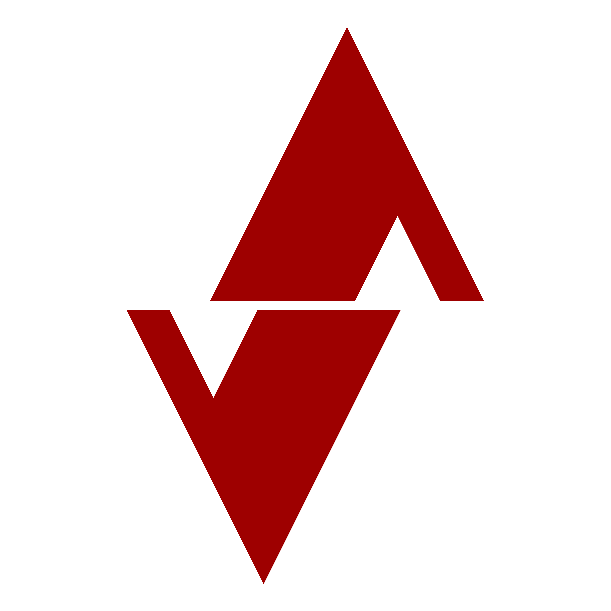

<div align="center">
  </img>
  
  # Nukleus
  ### Redefining Simplicity and Speed in Programming
  
  <p align="center">
    <a href="https://github.com/Nukleus-Language/nukleus/actions/workflows/rust.yml">
      
    </a>
    <a href="https://github.com/Nukleus-Language/nukleus/actions/workflows/rust-clippy.yml">
      
    </a>
    <a href="https://drone.nornity.com/Nukleus-Language/nukleus">
      
    </a>
  </p>
  
  <p align="center">
    A revolutionary programming language designed with a focus on <strong>AI</strong>, <strong>GUI</strong>, and <strong>cross-platform</strong> development.
    <br>
    Built with the robustness of Rust for high performance, reliability, and ease of maintenance.
  </p>
</div>

---

## Table of Contents

- [Project Status](#project-status)
- [Current Capabilities](#current-capabilities)
- [Example Code](#example-code)
- [Planned Features](#planned-features)
- [Getting Started](#getting-started)

---

## Project Status

<table align="center">
  <tr>
    <td align="center">
      <strong>Development Phase</strong><br>
      🚧 Early Development
    </td>
    <td align="center">
      <strong>Core Compiler</strong><br>
      ✅ Live & Functional
    </td>
    <td align="center">
      <strong>Interpreter</strong><br>
      🧪 Experimental
    </td>
  </tr>
</table>

> **Note**: While Nukleus is still in its early stages, our team is devoted to bringing an array of exciting features to life. Stay tuned for the journey ahead!

---

## Current Capabilities

### ✅ Compiler Features

The current compiler supports essential programming constructs:

| Feature | Status | Description |
|---------|--------|-------------|
| **Recursive Functions** | ✅ | Functions can call themselves for complex computations |
| **Operator Precedence** | ✅ | Mathematical expressions follow standard evaluation order |
| **Control Structures** | ✅ | `if/else` conditionals and `for` loops |
| **Strong Typing** | ✅ | Type safety and reliability built-in |

### ⚠️ Current Limitations

- **Console Output**: No direct print/output functionality yet
- **Limited Scope**: Optimized for specific sample programs like `Fibonacci.nk`

> The experimental **interpreter** offers broader code execution capabilities, showcasing the language's full potential.

---

## Example Code

Here's a sample Fibonacci implementation in Nukleus:

```rust
fn fibonacci(i64:n) -> i64 {
    let:i64 return_val = 0;
    if(n < 2) {
        return_val = n;
    } else {
        return_val = fibonacci( n-1 ) + fibonacci( n-2 );
    }
    return return_val;
}

fn main() -> i64 {
    let:i64 x = 47;
    return fibonacci(x);
}
```

---

## Planned Features

### Core Language Features
- [x] **Intuitive Syntax** - Clean, modern language design
- [x] **Strong Typing** - Enhanced reliability and maintainability
- [ ] **Rich Standard Library** - Comprehensive built-in functionality
- [ ] **Rust Integration** - Expandability with Rust ecosystem

### Performance & Efficiency
- [x] **Cross-Platform** - Run anywhere
- [ ] **Rust-Powered Performance** - Maximum efficiency and speed
- [ ] **Memory Safety** - Rust's safety guarantees

### Specialized Toolkits
- [ ] **Integrated GUI Toolkit** - Native cross-platform interfaces
- [ ] **Comprehensive AI Toolkit** - Built-in machine learning capabilities
- [ ] **Documentation System** - User-centric docs with practical examples

---

## Getting Started

### Prerequisites
- Rust toolchain (for building from source)
- Git for cloning the repository

### Quick Start

1. **Clone the Repository**
   ```bash
   git clone https://github.com/Nukleus-Language/nukleus.git
   cd nukleus
   ```

2. **🔨 Build the Project**
   ```bash
   cargo build --release
   ```

3. ** Run Sample Programs**
   ```bash
   # Try the Fibonacci example
   ./target/release/nukleus examples/Fibonacci.nk
   ```

4. ** Write Your First Program**
   - Create a new `.nk` file
   - Use the sample programs as reference
   - Experiment and modify existing examples

### Next Steps
- Explore the `examples/` directory for more sample programs
- Check out our [documentation](#) (coming soon)
- Join our community discussions
- Contribute to the project development

---

<div align="center">
  <p>
    <strong>Ready to explore the future of programming?</strong><br>
    Star ⭐ this repository to stay updated with our progress!
  </p>
  
  <p>
    <a href="https://github.com/Nukleus-Language/nukleus/issues">Report Issues</a> •
    <a href="https://github.com/Nukleus-Language/nukleus/discussions">Join Discussions</a>
  </p>
</div>
